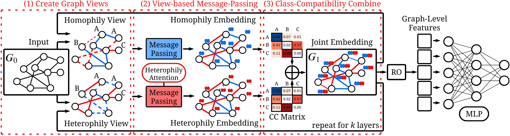

# Bi-View

Official Code for BiView, a message-passing architecture for graph classification under homophily and heterophily.

## Requirements:

cudatoolkit==11.8.0

python==3.9

pytorch==2.2.2

torch-geometric==2.4.0

pytorch-scatter==2.1.2

pytorch-sparse==0.6.18

numpy==1.26.4

## How to run:

### TUDatasets:

    python main_BiView.py --dataset={dataset} --collection='tud' --model='BiView'

### OGB Datasets:

    python main_BiView.py --dataset={dataset} --collection='ogb' --feature_as_label=6 --model='BiView'

## Datasets
**TUDatasets** include **NCI1**, **NCI109**, **MUTAG**, **Mutagenicity**, **ER_MD**, **COX2_MD**, **PROTEINS** and **DD**.

**OGB Datasets** include **ogbg-molbace** and **ogbg-molhiv**.
